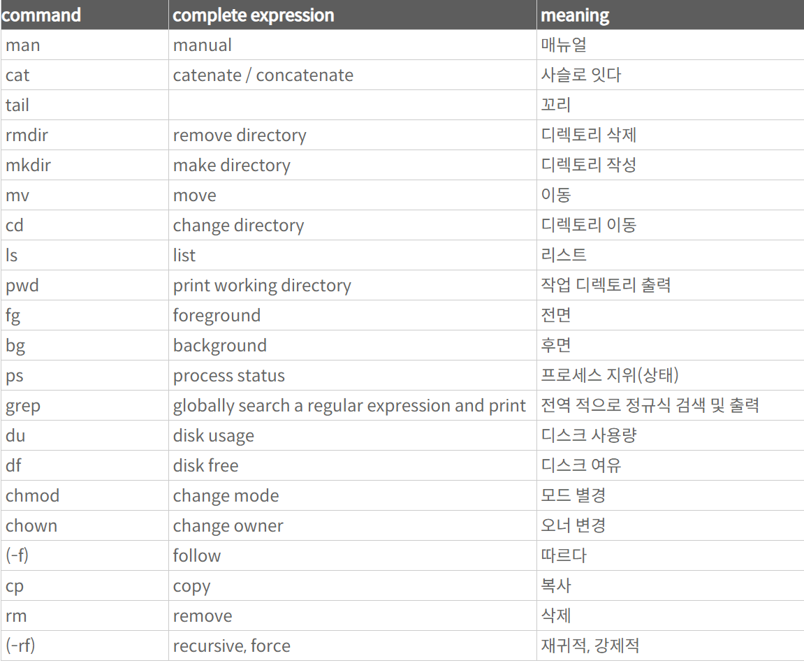

# Linux Master
# 2024-04-25 DIL

|주차|DIL 범위|날짜|개인 진도|
|------|---|---|---|
| 1주차 | 2-5장 |2024-04-25|num 14-30|


# 14. shutdowm 명령어의 옵션에 대한 설명

- -c: 예약된 shutdown 명령을 취소한다.
- -h: shutdown 명령이 완료되면 시스템을 정지시킨다.
- -r: shutdown 명령이 완료되면 시스템을 재부팅한다.  

# 15. ihduser 사용자가 현재 hannam이라는 그룹에 속해있다면 ihduser 사용자의 그룹을 IHD로 변경할 때 알맞은 것은?

: usermod -g IHD ihduser
: usermod -g [변경그룹] [사용자이름]


# 16. reboot 명령어의 수행과정에 대한 설명으로 틀린 것은?


# 22. mount 명령어 옵션

mount: 보조 기억 장치(하드디스크. usb)를 디렉토리처럼 사용할 수 있는 명령어.

## 명령어 사용법:

```
mount [option][device][directory]
```


|option|의미|
|------|----|
| -a | /etc/fstab에 기록되어 있는 모든 파일시스템을 마운트 할 때 사용|
| -t파일시스템_타입 | 파일 시스템의 유형을 지정하는 옵션, 지정하지 않으면 /etc/fstab 참조|
| -o 항목 | 마운트 시 세부적인 옵션을 적용시킬 때 사용 |


# 23. 주 파이션에 대한 설명

- 부팅 가능한 파티션으로 디스크에 하나 이상 존재해야 한다.
- 하나의 디스크에 총 4개까지 사용가능하다.
- 3개 영역으로 파티션 분할할 경우에 주 파티션 내에 설치 가능하다.

# 24. 기본적인 패스워드 설정방법

- 기본적으로 최소 6자 이상이어야 함.
- 특수문자와 숫자 등도 가능함.
- 대, 소문자를 구분함.
- 최초 설정 후 바꿀 수 있음.

# 25. E-IDE 타입의 디스크를 Secondary Slave에 연결했을 경우에 인식하는 장치 (리눅스 하드디스크관리 관련 개념/ 하드디스크 일반.)

- /dev/hdd

### 리눅스에서 사용하는 디스크타입
- SAS 타입
- SATA 타입
- SCSI 타입
- IDE 타입: 
/dev/hda: Primary Master
/dev/hdb: Primary Slave
/dev/hdc: Secondary Master
/dev/hdd: Secondary Slave 
등과 같은 형식으로 장치명을 사용한다.


# 26. 교육용 유닉스로 리눅스 개발의 시발점이 된 운영 체제는?

- Minix


# 27. 명령행에서 입력을 전환할 때 사용하는 기호

- <





## 기초 리눅스 용어 암기항목 정리

- sudo: superuser do 슈퍼유저로서 프로그램을 구동할 수 있게 한다.

- pwd(print work directory): 현재 위치하고 있는 디렉토리 표시

-ls(List Segments): 현재 위치해 있는 곳의 파일, 디렉토리의 정보를 제공.pwd와 함께 사용하여 파일의 위치 및 정보를 알아내는데 유용함.

- rm filename 파일제거
- rm -fr filename: 파일 강제 삭제
- touch: 파일 새성하고 타임스탬프 변경
- semange: 보완정책을 추가, 삭제, 변경하는 명령어.
- chown: change owner of file의 약자. 파일의 소유자를 바꿀 수 있다. 보통 슈퍼 사용자가 사용할 수 있으며, 권한이 없는 사용자가 파일의 그룹을 변경하기 위해서는 chgrp를 사용해야 한다.
- chmod: change mode of file: 파일의 권한을 변경할 때 사용하는 명령어.
권한: 읽기(r) ,쓰기(w), 실행(x) 으로 이루어져 있다.

- systemctl: 서버 관리 시 입력하는 명령어이다.

- cd - : 이동하기 직전 디렉토리로 이동.
- cd/dir: 절대경로 dir로 이동.
- cd ~: 어느 곳에서든지 홈 디렉토리로 바로 이동.

- man: 000 manual : 000의 메뉴얼을 확인하고 싶을 때 사용함. 
- 메뉴얼에서 


# 28. 우분투 리눅스 기반이 되는 리눅스

: Devian


===

# 29. groupaddihdl
# groupadd:unabletolockgroupfile

: ihdl 이라는 그룹을 생성하려 하였으나, 권한이 없어서 제대로 실행하지 못하고 있다.


===========================================================================

# Naver Cafe

# 11. 다음 중 상용판 리눅스로 알맞은 것은?

: RHEL

# 12. **현재 접속**되어 있는 모든 사용자들에게 **메시지**를 보낼 때 사용되는 명령어는?

: wall

- echo: 문자열을 '그대로' 출력해주는 명령어
- message: 메시지 응답 가능 및 불가 여부를 설정 O/X
- talk: 로그인한 사용자끼리 대화시에 사용하는 명령어.


# 13. 다음 중 **슬랙웨어 계열 리눅스에 속하는 배포판**으로 알맞은 것은?

- Salix OS
- Vector Linux
- SUSE
- 아닌 것: Knoppix

# 14. 리눅스의 **섀도우 패스워드**에 대한 설명으로 알맞은 것은?

- 사용자의 패스워드를 한번 더 암호화하여 보안을 강화 시키는 기능.

# 14-1. 섀도 패스워드를 사용할 때, /etc/passwd 파일에 포함된 내용으로 틀린 것은?

: 패스워드

# 15. 다음 각 명령어에 대한 설명으로 알맞은 것은?

- head: 파일의 처음 부분을 보여준다.
- head - 10 file.txt: file.txt 파일의 앞 부분 10줄에 대한 내용을 출력.
- tail: 파일의 마지막 부분을 보여준다.
- file: 파일의 종류/파일 속성 값을 알고자 할 때 사용.
- uniq: 중복된 내용의 행을 하나의 행으로 만들어주는 명령어.
- uniq -c: 중복된 개수를 count함.

# 16. 다음에서 설명하는 리눅스 배포판으로 알맞은 것은?
데비안 기반으로 만들어진 리눅스 배포판으로 다양한 해킹 도구를 내장하고 있어 정보보안에 대해 학습할 때 매우 유용하다.
- Kali Linux

# 17. . mkdir .fileA와 같이 디렉토리를 생성하면 그 결과는?

- ls 명령어에서 -a 옵션을 이용하면 .fileA 디렉토리를 찾을 수 있다.
- cd라는 명령어를 통해서 .fileA 디렉토리 안으로 이동할 수 있다.

# 18. 사용 중인 시스템의 도메인 네임을 출력하기 위해 사용할 수 있는 명령어로 알맞은 것?

- hostname

- ping: 네트워크로 연결되는 대상(시스템)과 연결이 정확하게 되어있는지를 테스트할 때 사용하는 네트워크 명령어. -> 네트워크 연결 확인 명령어
- ifconfig: 현재 시스템의 네트워크 설정 상태 등을 확인해 볼 수 있는 명령어.


# 19. 다음 중 설치와 관련된 장치 선택에서 특별한 저장 장치를 선택하는 디스크 유형으로 틀린 것?

: SCSI

# 20. 일반적으로 시스템 부팅에 필요한 파일이 있는 디렉토리는?

: /boot

- /root: root 사용자만 사용이 가능함./ 일반 사용자 출입 불가.
- /bin/bash: 기본적인 파일처리 명령 등의 여러가지의 명령어들이 실행 파일의 형태로 저장되어 있음. 이 안의 명령어는 어떠한 경로에 있던지 실행되게 되어 있음.
- /sbin: 파일 시스템 처리 명령, 네트워크 인터페이스 설정 등 전반적인 시스템 관리 명령어들이 있는 디렉터리임.(root 사용자 계정에만 허가되어 있음.)

# 20-1. 다음 중 부트로더인 GRUB 관련 파일들이 들어 있는 디렉터리로 알맞은 것은?

- /boot: 리눅스 계열에서 OS 부팅에 사용되는 파일을 담는 폴더. GRUD(부트로더), list+found(fsck 등에서 발견된 결함이 있는 파일)에 대한 정보를 보관.

- /usr(Universal System Resources): 시스템, 응용 프로그램에서 필요한 파일들이 저장되어 있는 디렉터리. 설치할 때 하드디스크에서 가장 많은 용량을 지정해 주어야 하는 디렉터리.

- /opt(Operation): Add-On 응용 소프트웨어 패키지가 설치됨. 레드햇 리눅스는 이 디렉터리를 구성하지 않는다. 

# 21. 명령어 정리

- $ who: 현재 시스템에 접속한 사용자를 확인하는 명령어
- $ w : 현재 시스템에 접속한 사용자 + 서버 정보를 확인하는 명령어
- $ id: 현재 사용자의 실제 id, 유효 사용자 id, 그룹 id를 확인할 수 있는 명령어.
- $ users: 시스템에 접속해 있는 사용자의 ID를 확인하는 명령어.

# 22. 다음 중 리눅스에서 패킷이 특정 호스트까지 전달되는 과정을 출력하는 명령으로 알맞은 것은?


- traceroute

# 24.

# 25. 파일 비교와 관련이 있는 명령어는?

- cmp: 유사한 두 파일을 비교하여 처음으로 틀린 문자가 나타나는 위치만을 출력하는 명령어
- comm: 행 단위 파일 비교하는 명령어.
- diff: 두 파일의 차이점을 비교하는 명령어.

- gcc: 컴파일에 사용되는 명령어.

# 26. 

# 27. #cal 명령어의 실행 결과?

: 오늘 날짜를 기준으로 속한 달이 출력된다.

- cal: 달력을 출력하는 명령어.
- cal 10 2021 : 2021년도의 10월 달력이 출력됨.
- #date: 현재위 년-월-일-시 순으로 확인이 가능함.
- #hwclock: 하드웨어 시간을 확인할 때 사용.
- #time: 프로그램의 실행 시간을 확인할 때 사용.

# 28. 특정 파일을 찾음과 동시에 삭제하는 과정.

find [경로] [-옵션] [찾는 파일명] [action]

- -옵션종류
- name: 이름으로 찾기
- user: 소유자로 찾기
- newer: 전, 후의 조건으로 찾기
- perm: 퍼미션으로 찾기 (+와-를 사용)
- size: 크기(용량)으로 찾기
- type: 파일 종류로 찾기(d: 디렉토리, f: 파일)

- -action으로 찾기
- exec 명령 {} w; 검색된 파일에 명령을 실행한다.
- ok 명령 {} W; 사용자의 확인을 받아서 명령을 실행한다.
- print : 검색된 파일의 절대 경로명을 화면에 출력한다. (기본동작)
- ls: 검색 결과를 긴 목록 형식으로 출력한다.

# 29. 다음에서 설명하는 리눅스 배포판으로 알맞은 것은?

레드헷 엔터프라이즈 리눅스의 소스 코드를 그대로 가져와 빌드해 내놓는 일종의 복제본으로 비용 부담없이 사용이 가능하다: CentOS
    
# 30. shutdown 명령어

shutdown: 시스템을 재시작하거나 전원을 종료하는 명령어. root 권한자만 사용 가능.
shutdown [option] 시간 [경고메시지]
- -c: 예약된 작업을 취소할 때 사용하는 옵션.
- -r: 시스템을 재시작
- -P: 강제로 시스템 종료
- -k: 실제로 종료 명령을 수행하지 않고 종료된다는 메시지만 출력.
- -h: shutdown 명령이 완료되면 시스템을 정지시킨다.
- +m: m분 후에 시스템을 종료
- 이외에도 시스템 종료 명령어에는 reboot, halt, poweroff 등이 있다.

# 33. 다음 중 리눅스의 기술적인 특징으로 알맞은 것은?

- 정적 라이브러리는 쉽게 말해 특정 프로그램 실행 시 해당 프로그램에 라이브러리를 모두 포함시키는 것이다.
  
- **동적 라이브러리** : 프로그램에서 특정한 기능을 하는 루틴들을 실행 파일 내부에 넣어두지 않고, 프로그램을 실행할 때마다 그때그때 가져다 사용하므로 효율성이 아주 높다. 

- 가상 메모리: 하드디스크의 일정 부분을 메모리의 역할로 전환하여 사용한다.

# 34. 특정 호스트를 찾기 위해 사용하는 명령어로 호스트가 속한 네임서버에 질의하는 네임서버 질의 명령어는?

- hostname: 현재 호스트의 이름을 확인하거나 호스트의 이름을 변경할 때 사용하는 명령어.

- ifconfig: 현재 설정된 네트워크 환경을 확인할 떄 사용하는 명령어.
- dig: 특정 도메인이 사용하는 IP 주소를 조회하는 명령어.
- netstat: 네트워크의 현재 상태를 확인하고자 할 때 사용하는 명령어.

# 35. 다음 중 데비안 계열 리눅스에 속하는 배포판으로 옳은 것은?

- elementary OS
- Kali Linux
- Knoppix
  
- X : Salix OS

- **슬랙웨어 계열**: SUSE OpenSUSE, Slax OS, Vector Linux, Deli Linux,Frugalware, Salix OS
- **레드헷 계열**: Redhat Enterprise Linux, CentOS, Fedora, AnNyung Linux, Oracle Enterprise Linux, 타이젠
- **데비안 계열**: 우분투, 민트, Kali Linux, knoppix, crunchBang Linux, Steam OS, Damn Small Linux, elementary OS, 기린, 하모니카
- **맨드리바 계열**: Open Mandriva, Mageia, PCLinuxOS
- **안드로이드 계열**: ANdroid, chrome OS, Remix OS, Polaris OS


# 36. root 사용자가 사용자 choi의 비밀번호를 변경하는데 사용하는 명령어는?

- passwd choi : root 관리자 계정으로 일반 사용자 choi의 패스워드를 변경하고자 한다면 passwd choi를 하면 된다.

# 37. 다음 중 ihduser의 계정 만기일을 '2020-12-31'로 설정할 때 알맞은 것은?

- usermod -e 2020-12-31 ihduser

# usermod를 이용하여 계정의 정보를 수정할 수 있다.
usermod [옵션] [계정이름]

- -c: 계정에 대한 설명을 지정 (/etc/passwd에서 확인 가능.)
- -d: 계정의 홈 디렉터리 변경 (/etc/passwd에서 확인 가능.)
- -m : 사용자의 홈 디렉터리 변경 시 파일과 디렉터리도 함께 옮겨준다.
- -e: 계정의 종료일을 지정 (/etc/shadow에서 확인 가능.)
- -g: 계정의 GID(그룹)을 지정
- -G: 계정의 보조 그룹을 지정
- -u: 계정의 UID를 지정
- -s: 계정의 로그인 셸 지정
- -l: 사용자 계정명 변경
- -f: 패스워드 만기일이 지난 후 패스워드 잠금을 설정할 유예기간을 지정한다.

